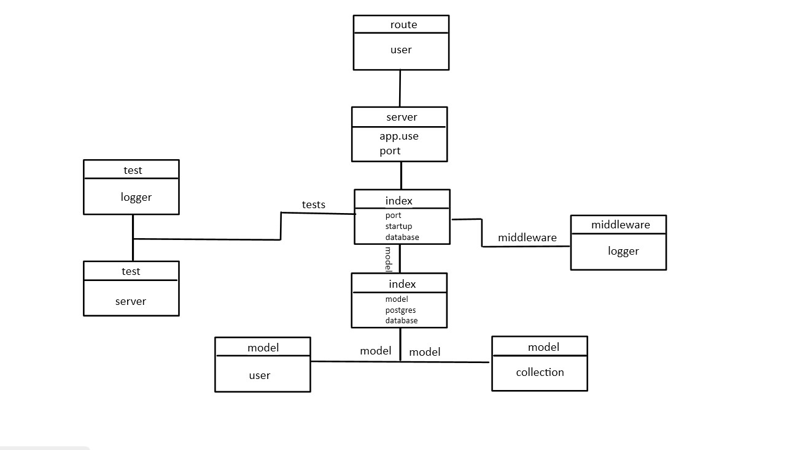

# basic-auth

## uml :

##### Author : Ibrahim Khdairat 

* [GitHub Repo Link](https://github.com/MAMOUN-kamal-alshisani/basic-auth)

* [Pull Request](https://github.com/MAMOUN-kamal-alshisani/basic-auth/commit/6c2575a7ea886905634900307c0c7577dec79e48)

* [Heroku Link](https://basic-auth-1.herokuapp.com/AllUsers/) 

##### Setup
.envre quirements
  * PORT - Port Number

**Running the app**
* `npm start`
* Endpoints:
* ##### 1 -  `/status`

***Returns Object***

>[{
"id": 1,
"userName": "mamoun",
"userPassword": "0000",
"createdAt": "",
"updatedAt": ""
},

**Tests**
***Unit Tests: npm run test***